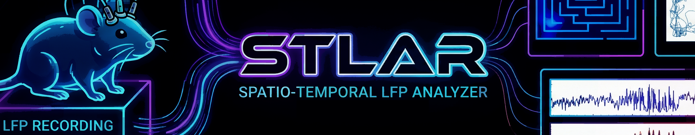

# STLAR: Spatio-Temporal LFP Analyzer



STLAR (or **Stellar**) is a comprehensive Spatio-Temporal LFP analysis tool combining temporal HFO detection (hfoGUI), spatial spectral mapping, and deep learning classification capabilities.

---

## 📑 Table of Contents

### Getting Started
- [Features](#features)
- [Installation](#installation)
- [Quick Start](#quick-start)

### Usage
- [GUI Workflow](#gui-workflow)
- [Command-Line Interface (CLI)](#cli-reference)
- [Deep Learning Training](#complete-deep-learning-training-workflow)

### Advanced
- [Module Structure](#module-structure)
- [Technical Reference](docs/TECHNICAL_REFERENCE.md)
- [API Documentation](#api-documentation)

### Support
- [Troubleshooting](#troubleshooting-installation)
- [Getting Help](#getting-help)
- [Recent Changes](#recent-changes)

---

## Features

### 🕐 Temporal Analysis
- HFO detection (ripples 80-250 Hz, fast ripples 250-500 Hz)
- Multi-band filtering and visualization
- Time-frequency analysis (Stockwell transform)
- Event scoring and annotation
- Multiple automated detection algorithms (Hilbert, STE, MNI, Consensus, Deep Learning)

### 🗺️ Spatial Analysis
- Frequency heatmaps across arena
- Position tracking overlay
- Spatial power distribution
- Arena coverage visualization
- Multi-channel spatial mapping

### 🔗 Spatio-Temporal Integration
- Synchronized temporal-spatial views
- HFO location mapping
- Behavioral state-dependent analysis
- Cross-region coordination metrics

### 🤖 Deep Learning
- Automated HFO classification with 1D CNN models
- Train custom models on your data with **real-time GUI monitoring**
- PyTorch (.pt) and ONNX export
- Pre-trained models available
- CLI tool to prepare training data with behavioral annotation and train/val splitting

### ⚡ Batch Processing
- Multi-file batch CLI processing with 5 detection methods + training data prep
- Recursive directory scanning
- Configurable detection thresholds
- Progress tracking and summary statistics

## Installation

### Requirements
- **Python 3.8+** (check with `python --version`)
- **pip** (Python package manager, usually included with Python)
- ~2-3 GB disk space for dependencies

### Step-by-Step Installation (For Beginners)

#### 1. Install Python (if needed)
If you don't have Python installed:
- **Windows:** Download from [python.org](https://www.python.org/downloads/) → Run installer → ✅ Check "Add Python to PATH"
- **macOS:** Use [homebrew](https://brew.sh/) → `brew install python3`
- **Linux:** `sudo apt-get install python3 python3-pip`

Verify installation:
```bash
python --version
pip --version
```

#### 2. Clone the Repository
```bash
# Download STLAR source code
git clone https://github.com/HussainiLab/STLAR.git
cd STLAR
```

**No git installed?** Download ZIP from GitHub → Extract → Open command prompt in the folder

#### 3. Create Virtual Environment (Recommended)

Using a virtual environment keeps STLAR's dependencies isolated from your system Python.

**Option A: Using Conda (Recommended for Data Science)**

```bash
# Create new environment named "stlar"
conda create -n stlar python=3.10

# Activate the environment
conda activate stlar

# You should see (stlar) at the start of your command prompt
```

To activate later: `conda activate stlar`  
To deactivate: `conda deactivate`

**Option B: Using venv (Built into Python)**

```bash
# Windows
python -m venv stlar
stlar\Scripts\activate

# macOS/Linux
python3 -m venv stlar
source stlar/bin/activate

# You should see (stlar) at the start of your command prompt
```

To activate later: 
- Windows: `stlar\Scripts\activate`
- macOS/Linux: `source stlar/bin/activate`

To deactivate: `deactivate`

**Why use an environment?**
- ✅ Prevents dependency conflicts with other Python projects
- ✅ Easy to reset if something breaks (`conda env remove -n stlar`)
- ✅ Reproducible setup across machines

#### 4. Install Dependencies
```bash
# Windows/macOS/Linux - same command
pip install -r requirements.txt
```

**Takes 2-5 minutes depending on internet speed.** You should see packages downloading.

#### 5. (Optional) Install as Editable Package
```bash
# Allows updating STLAR without reinstalling
pip install -e .
```

**Done!** You can now run STLAR.

#### Deep Learning (Optional Dependencies)

Install these only if you plan to use deep learning detection (`dl-batch`) or the GUI's DL features.

CPU-only (works everywhere):

```bash
pip install torch onnxruntime
```

GPU-accelerated (CUDA 11.8, NVIDIA GPUs):

```bash
# Activate your environment first (e.g., conda activate stlar)
pip install --index-url https://download.pytorch.org/whl/cu118 torch torchvision torchaudio
pip install onnxruntime-gpu  # optional; fallback is onnxruntime (CPU)
```

Notes:
- If `torch` is not installed, running `python -m stlar dl-batch ...` will print guidance and exit gracefully.
- ONNX is optional; STLAR supports TorchScript models out of the box.
- Verify GPU availability with: `python -c "import torch; print(torch.cuda.is_available())"`.

### Troubleshooting Installation

**"Command not found: python"**
- Try `python3` instead of `python`
- Windows: Add Python to PATH (search "environment variables" → add Python installation folder)

**"Permission denied" (macOS/Linux)**
```bash
pip install --user -r requirements.txt
```

**Conda environment not activating**
- Make sure conda is initialized: `conda init` → restart terminal
- Check environment exists: `conda env list`

**ImportError when running STLAR**
- Ensure environment is activated: `conda activate stlar` or `source stlar/bin/activate`
- Ensure all dependencies installed: `pip install -r requirements.txt --upgrade`
- Check you're in the STLAR directory: `pwd` (macOS/Linux) or `cd` (Windows)

---

## Quick Start

### 🎯 Choose Your Path

STLAR offers three ways to analyze data. **New users should start with the GUI (option 1).**

#### 1️⃣ **GUI (Easiest - Recommended for Beginners)**

No command-line knowledge needed! Everything is point-and-click.

**Launch the HFO Analysis GUI:**
```bash
python -m stlar gui
```

You'll see a window with buttons to:
- 📂 **Load** your EEG/EGF file
- 🔍 **Detect** HFOs with different methods (Hilbert, Consensus, Deep Learning, etc.)
- 📊 **View** detected events in a table
- 🏷️ **Score** events (label as ripples, artifacts, etc.)
- 💾 **Save** results to a text file

**GUI Workflow (step-by-step):**

1. **Load Data:** Click "File" → "Open" → select your `.eeg` or `.egf` file
2. **Set Parameters:** Adjust sliders for frequency bands, thresholds (don't worry about exact values)
3. **Detect Events:** Click "Run Detection" (Hilbert is fastest)
4. **Review Results:** Browse detected events in the **Automatic Detection** tab
5. **Move to Score Tab:** Select events you want to keep → Click **"Add Selected EOI(s) to Score"**
6. **Label Events:** In the Score tab, select each event and click score buttons (Ripple, Fast Ripple, Artifact, etc.)
7. **Save Results:** Click "Save Scores" to export to a text file

**Tip:** Use the **"None"** option in "Brain Region" dropdown if you don't want region-specific filtering.

---

**Launch the Spatial Mapper GUI:**
```bash
python -m stlar spatial-gui
```

This shows a heatmap of HFO activity across the recording arena with position tracking overlays.

---

#### 2️⃣ **Command Line (For Batch Processing)**

Process multiple files automatically without the GUI. Good for processing dozens of files consistently.

**Example: Process all files in a folder**
```bash
python -m stlar hilbert-batch -f mydata/
```

**What this does:**
- Finds all `.eeg` and `.egf` files in `mydata/` (including subfolders)
- Detects ripples using the Hilbert filter method
- Saves results to `HFOScores/` automatically
- Shows progress in the terminal

**More examples:**

Use consensus voting (more reliable but slower):
```bash
python -m stlar consensus-batch -f mydata/ -v
```

Process a single file:
```bash
python -m stlar hilbert-batch -f mydata/recording.eeg -o results/
```

Show detailed progress:
```bash
python -m stlar hilbert-batch -f mydata/ -v
```

**Output:** Detected events saved as `.txt` files in `HFOScores/`

---

#### 3️⃣ **Python API (For Programmers)**

Use STLAR from your own Python scripts:

```python
from hfoGUI.core.Detector import Detector

# Load your data
detector = Detector('mydata.eeg')

# Detect ripples
ripples = detector.detect_ripples(method='hilbert')
print(f"Found {len(ripples)} ripples")

# Detect fast ripples
fast_ripples = detector.detect_ripples(method='hilbert', 
                                      freq_min=250, freq_max=500)
```

---

### GUI Workflow Overview

**The Score window workflow (fast overview):**

1. **Detect EOIs** with Hilbert / STE / MNI / Consensus / Deep Learning in the **Automatic Detection** tab
2. **Select EOIs** from the detection table and click **"Add Selected EOI(s) to Score"** to move them to the **Score** tab
   - 💡 The **"None"** brain region option skips filtering if you don't want preset parameters
3. **Refine scores**: add, relabel, hide, or delete scores manually
4. **Save results** to a text file for further analysis
5. *(Optional)* **Export for DL training**: Use **"Export EOIs for DL Training"** to create training data
6. *(Optional)* **Train custom model**: Train a Deep Learning model on your labeled data
7. *(Optional)* **Run DL detection**: Use your trained model on new recordings

---

### File Format Support

- **.eeg** - Tint format (most common for spike sorting)
- **.egf** - Intan format (includes embedded position tracking)
- **.edf** - Standard EDF format (medical device recordings)

**Don't have sample data?** STLAR includes test data in `tests/` directory.

---

## GUI Workflow

This section provides a detailed walkthrough of the GUI-based analysis. If you're new to STLAR, **start here**.

### Step 1: Launch the GUI

```bash
python -m stlar gui
```

You should see the STLAR window open with several tabs.

### Step 2: Load Your Data

1. Click **"File"** menu → **"Open"**
2. Navigate to your `.eeg` or `.egf` file
3. The signal will appear in the graph area

### Step 3: Set Up Detection Parameters

On the left side, you'll see parameter sliders:

- **Freq Min / Freq Max**: Frequency band to search (e.g., 80-250 Hz for ripples)
- **Threshold (SD)**: Sensitivity (3-4 is typical, lower = more events)
- **Min/Max Duration (ms)**: How long events must be (15-120 ms for ripples)

**Tip:** Don't overthink these! Start with defaults and adjust based on your results.

### Step 4: Run Detection

Click **"Run Detection"** on your chosen tab:

- **Hilbert** (fastest, good for exploration)
- **STE** (Stockwell transform, frequency-based)
- **MNI** (more conservative)
- **Consensus** (voting between methods - more reliable)
- **Deep Learning** (requires pre-trained model)

Wait for detection to complete. You'll see events appear in the **Automatic Detection** table.

### Step 5: Review & Filter Results

In the **Automatic Detection** tab:

1. **Sort by Duration**: Click the "Duration" column header to sort by event length
2. **Preview events**: Click an event to highlight it in the signal graph
3. **Adjust threshold**: If too many false positives, increase "Threshold (SD)"

### Step 6: Move Events to Score Tab

1. **Select events**: Click one event, then Ctrl+Click to select multiple
2. Click **"Add Selected EOI(s) to Score"** button
3. Events move to the **Score** tab for manual labeling

**Important:** Choose a **Brain Region** (LEC, Hippocampus, MEC, or **None**) before adding:
- If you select a region, STLAR applies preset filters (duration, behavior)
- If you select **"None"**, events are added without any filtering

### Step 7: Label Events in Score Tab

For each event in the Score tab:

1. Select the event
2. Choose a label: **Ripple**, **Fast Ripple**, **Sharp Wave Ripple**, or **Artifact**
3. Set **Scorer name** and **Brain Region** (if not set earlier)

**Keyboard shortcuts:**
- **R** = Ripple
- **F** = Fast Ripple
- **S** = Sharp Wave Ripple
- **A** = Artifact
- **Delete** = Remove selected event

### Step 8: Save Your Results

1. Click **"Save Scores"**
2. Choose a location for the `.txt` file
3. File is saved and ready for analysis or spatial mapping

---

### Deep Learning Features

**New in STLAR:** Easy-to-use DL training from the GUI!

#### Train a Custom Model

1. Go to **"Deep Learning"** tab → **"Train"**
2. Select your training and validation manifests (from `prepare-dl` command)
3. Select a model architecture:
   - **1D Models** (1-4): Simple CNN, ResNet1D (default), InceptionTime, Transformer
   - **2D Models** (5-6): Spectrogram CNN, CWT CNN (Scalogram-based)
4. *(Optional)* Enable **"Use CWT (Scalogram) Preprocessing"** checkbox:
   - Converts 1D raw segments to 2D CWT scalograms
   - Typically used with 2D model types (5-6) for best results
   - Not compatible with 1D model types (1-4)
5. Adjust parameters (epochs, learning rate, batch size) - see defaults first!
6. Click **"Start Training"**
7. Watch training progress in real-time (optional GUI monitor)

**Training parameters saved automatically** to `training_params.json` with recommendations for next iteration:
- If overfitting detected: suggests increasing regularization
- If loss plateaus: suggests reducing learning rate
- If training unstable: suggests smaller batch size

#### Export & Use Your Model

1. Go to **"Deep Learning"** tab → **"Export"**
2. Select your best checkpoint (`best.pt`)
3. Choose output directory
4. Click **"Export"** to create TorchScript (.pt) and ONNX formats

Then use the exported model for detection with the CLI or GUI.

#### Debug CWT Scalograms in GUI

To verify CWT preprocessing during GUI-based detection, set an environment variable before launching:

**Windows (PowerShell):**
```powershell
$env:STLAR_DEBUG_CWT = "debug_scalograms"
python -m stlar gui
```

**Linux/macOS:**
```bash
export STLAR_DEBUG_CWT="debug_scalograms"
python -m stlar gui
```

When you run DL detection with a CWT model, scalogram images will be saved to the specified directory for inspection. Leave the environment variable unset for normal operation (no images saved).

---

### Image Capture Checklist (for README visuals)

- Banner: `docs/images/banner.png` – Composite of HFO GUI and Spatial Mapper.
- HFO GUI: `docs/images/hfo_gui_annotated.png` – Signal view, detected events, parameters, event list.
- Spatial Mapper: `docs/images/spatial_mapper_annotated.png` – Heatmap, tracking overlay, power scale, controls.
- CLI Batch: `docs/images/cli_batch_processing.png` – Terminal running `python -m stlar hilbert-batch -f data/ -v` with progress.
- Output Example: `docs/images/output_example.png` – Signal trace with detected HFO spans and IDs.
- Methods Comparison (optional): `docs/images/methods_comparison.png` – Same segment with 5 methods.
- Heatmaps (optional): `docs/images/grid_heatmap.png`, `docs/images/polar_heatmap.png` – Grid vs. polar binning.

### Project Structure
```
STLAR/
├── hfoGUI/           # HFO detection (temporal analysis)
├── spatial_mapper/   # Spatial spectral mapping
├── stlar/            # Main command-line dispatcher
├── docs/             # Documentation & guides
│   ├── TECHNICAL_REFERENCE.md     # Algorithms & formulas (for scientists)
│   ├── CONSENSUS_DETECTION.md     # Consensus voting details
│   ├── CONSENSUS_QUICKSTART.md    # Quick guide
│   └── CONSENSUS_SUMMARY.md       # Summary table
├── tests/            # Unit tests
├── settings/         # User config (auto-created)
├── HFOScores/        # Output directory (auto-created)
└── requirements.txt  # Dependencies
```

## CLI Reference

### Overview

The command-line interface (CLI) allows batch processing of multiple files with consistent parameters. All commands use the format:

```bash
python -m stlar <command> [options]
```

**Supported commands:**
- **HFO Detection:** `hilbert-batch`, `ste-batch`, `mni-batch`, `consensus-batch`, `dl-batch`
- **Spatial Mapping:** `batch-ssm`
- **DL Training Data:** `prepare-dl`

**Key features:**
- ✅ Single-file or directory (recursive) processing
- ✅ Auto-detects .eeg and .egf files
- ✅ Progress tracking with `-v` (verbose) flag
- ✅ Customizable output directory with `-o`
- ✅ Reproducible with saved settings JSON files

### Output Format

Each detection creates files in the output directory:

```
HFOScores/
├── recording_name/
│   ├── recording_name_HIL.txt          # Detected HFOs (tab-separated)
│   ├── recording_name_HIL_settings.json  # Settings used (for reproducibility)
│   ├── recording_name_HFO_scores.eoi   # EOI format (for Tint)
│   └── ...
```

**Output file format:**
```
ID#     Start(ms)    Stop(ms)     Peak(µV)   Duration(ms)
HIL1    1234.56      1245.67      125.3      11.11
HIL2    2345.67      2356.78      118.9      11.11
...
```

**Common options across all commands:**
- `-f, --file` - Input file or directory (required)
- `-o, --output` - Where to save results (default: `HFOScores/`)
- `-v, --verbose` - Show progress details
- `-s, --set-file` - Location of .set files for scaling calibration

---

### Detection Methods

#### 1. Hilbert Detection
Envelope-based detection using analytic signal (Hilbert transform).

**Command:**
```bash
python -m stlar hilbert-batch -f <data_file_or_directory> [options]
```

**Examples:**

Single file:
```bash
python -m stlar hilbert-batch \
    -f data/recording.eeg \
    --threshold-sd 3.0 \
    --min-freq 80 \
    --max-freq 250 \
    --epoch-sec 300 \
    -v
```

Directory batch with custom output:
```bash
python -m stlar hilbert-batch \
    -f /data/recording_session/ \
    -s /data/recording_session/ \
    -o results/hilbert_detections/ \
    --threshold-sd 2.5 \
    --required-peaks 5 \
    -v
```

**Parameters:**

| Parameter | Type | Default | Description |
|-----------|------|---------|-------------|
| `-f, --file` | str | **required** | Path to .eeg/.egf file or directory |
| `-s, --set-file` | str | auto-detect | .set file or directory (for scaling calibration) |
| `-o, --output` | str | HFOScores/ | Output directory for results |
| `--epoch-sec` | float | 300 | Epoch length in seconds for analysis |
| `--threshold-sd` | float | 3.0 | Envelope threshold in SD above mean |
| `--min-duration-ms` | float | 10.0 | Minimum event duration (ms) |
| `--min-freq` | float | 80 | Minimum bandpass frequency (Hz) |
| `--max-freq` | float | 125 (EEG) / 500 (EGF) | Maximum bandpass frequency (Hz) |
| `--required-peaks` | int | 6 | Minimum peaks in rectified signal |
| `--required-peak-threshold-sd` | float | 2.0 | Peak threshold SD above mean |
| `--no-required-peak-threshold` | flag | off | Disable peak-threshold check |
| `--boundary-percent` | float | 30.0 | Percent of threshold to find boundaries |
| `--skip-bits2uv` | flag | off | Skip bits-to-uV conversion if .set missing |
| `-v, --verbose` | flag | off | Verbose progress logging |

---

#### 2. STE (Short-Term Energy / RMS) Detection
Fast detection based on RMS energy in sliding windows.

**Command:**
```bash
python -m stlar ste-batch -f <data_file_or_directory> [options]
```

**Examples:**

```bash
python -m stlar ste-batch \
    -f data/recording.eeg \
    --threshold 3.0 \
    --window-size 0.01 \
    --overlap 0.5 \
    --min-freq 80 \
    --max-freq 250
```

Directory batch:
```bash
python -m stlar ste-batch \
    -f /data/recordings/ \
    -o results/ste_detections/ \
    --threshold 2.5 \
    --window-size 0.01 \
    --overlap 0.75 \
    -v
```

**Parameters:**

| Parameter | Type | Default | Description |
|-----------|------|---------|-------------|
| `-f, --file` | str | **required** | Path to .eeg/.egf file or directory |
| `-s, --set-file` | str | auto-detect | .set file or directory |
| `-o, --output` | str | HFOScores/ | Output directory |
| `--threshold` | float | 3.0 | RMS threshold (SD or absolute value) |
| `--window-size` | float | 0.01 | Window size in seconds |
| `--overlap` | float | 0.5 | Window overlap fraction (0-1) |
| `--min-freq` | float | 80 | Minimum frequency (Hz) |
| `--max-freq` | float | 500 | Maximum frequency (Hz) |
| `--skip-bits2uv` | flag | off | Skip scaling conversion |
| `-v, --verbose` | flag | off | Verbose logging |

---

#### 3. MNI Detection
Percentile-based detection using baseline power statistics.

**Command:**
```bash
python -m stlar mni-batch -f <data_file_or_directory> [options]
```

**Examples:**

```bash
python -m stlar mni-batch \
    -f data/recording.eeg \
    --baseline-window 10.0 \
    --threshold-percentile 99.0 \
    --min-freq 80
```

Directory batch:
```bash
python -m stlar mni-batch \
    -f /data/recordings/ \
    -o results/mni_detections/ \
    --baseline-window 15.0 \
    --threshold-percentile 98.5 \
    -v
```

**Parameters:**

| Parameter | Type | Default | Description |
|-----------|------|---------|-------------|
| `-f, --file` | str | **required** | Path to .eeg/.egf file or directory |
| `-s, --set-file` | str | auto-detect | .set file or directory |
| `-o, --output` | str | HFOScores/ | Output directory |
| `--baseline-window` | float | 10.0 | Baseline window in seconds |
| `--threshold-percentile` | float | 99.0 | Threshold percentile (0-100) |
| `--min-freq` | float | 80 | Minimum frequency (Hz) |
| `--skip-bits2uv` | flag | off | Skip scaling conversion |
| `-v, --verbose` | flag | off | Verbose logging |

---

#### 4. Consensus Detection
Combines Hilbert, STE, and MNI detections using configurable voting strategy.

**Command:**
```bash
python -m stlar consensus-batch -f <data_file_or_directory> [options]
```

**Examples:**

Basic consensus (majority voting):
```bash
python -m stlar consensus-batch \
    -f data/recording.eeg \
    --voting-strategy majority \
    --overlap-threshold-ms 10.0
```

Strict consensus (all 3 methods must agree):
```bash
python -m stlar consensus-batch \
    -f /data/recordings/ \
    -o results/consensus_detections/ \
    --voting-strategy strict \
    --overlap-threshold-ms 5.0 \
    --hilbert-threshold-sd 3.5 \
    --ste-threshold 2.5 \
    --mni-percentile 98.0 \
    -v
```

Lenient consensus (any method detection):
```bash
python -m stlar consensus-batch \
    -f data/recording.eeg \
    --voting-strategy any \
    --overlap-threshold-ms 15.0
```

**Parameters:**

| Parameter | Type | Default | Description |
|-----------|------|---------|-------------|
| `-f, --file` | str | **required** | Path to .eeg/.egf file or directory |
| `-s, --set-file` | str | auto-detect | .set file or directory |
| `-o, --output` | str | HFOScores/ | Output directory |
| `--voting-strategy` | str | majority | `strict` (3/3), `majority` (2/3), or `any` (1/3) |
| `--overlap-threshold-ms` | float | 10.0 | Time window (ms) for overlapping detections |
| `--epoch-sec` | float | 300 | Hilbert epoch length (seconds) |
| `--hilbert-threshold-sd` | float | 3.5 | Hilbert envelope threshold (SD) |
| `--ste-threshold` | float | 2.5 | STE/RMS threshold |
| `--mni-percentile` | float | 98.0 | MNI threshold percentile |
| `--min-duration-ms` | float | 10.0 | Minimum event duration (ms) |
| `--min-freq` | float | 80 | Minimum frequency (Hz) |
| `--max-freq` | float | 125 (EEG) / 500 (EGF) | Maximum frequency (Hz) |
| `--required-peaks` | int | 6 | Hilbert minimum peaks |
| `--required-peak-sd` | float | 2.0 | Hilbert peak threshold (SD) |
| `--skip-bits2uv` | flag | off | Skip scaling conversion |
| `-v, --verbose` | flag | off | Verbose logging |

---

#### 5. Deep Learning Detection
Uses a pre-trained or custom neural network model for detection.

**Command:**
```bash
python -m stlar dl-batch -f <data_file_or_directory> --model-path <model> [options]
```

**Examples:**

```bash
python -m stlar dl-batch \
    -f data/recording.eeg \
    --model-path models/hfo_detector.pt \
    --threshold 0.5 \
    --batch-size 32
```

Directory batch with custom threshold:
```bash
python -m stlar dl-batch \
    -f /data/recordings/ \
    -o results/dl_detections/ \
    --model-path models/hfo_detector.pt \
    --threshold 0.7 \
    --batch-size 64 \
    -v
```

**Parameters:**

| Parameter | Type | Default | Description |
|-----------|------|---------|-------------|
| `-f, --file` | str | **required** | Path to .eeg/.egf file or directory |
| `-s, --set-file` | str | auto-detect | .set file or directory |
| `-o, --output` | str | HFOScores/ | Output directory |
| `--model-path` | str | **required** | Path to trained model (.pt or .onnx) |
| `--threshold` | float | 0.5 | Detection probability threshold (0-1) |
| `--batch-size` | int | 32 | Inference batch size |
| `--dump-probs` | flag | off | Print per-window probability stats + assessment (sanity-check model spread) |
| `--skip-bits2uv` | flag | off | Skip scaling conversion |
| `-v, --verbose` | flag | off | Verbose logging |

Tip: add `--dump-probs` to quickly see min/max/mean and percentile spread of DL probabilities; very narrow spreads usually mean the model needs more epochs or better labels.

---

### Batch Processing Workflow Examples

**Example 1: Quick single-file screening**
```bash
# Fast STE detection with verbose output
python -m stlar ste-batch \
    -f data/session_1.eeg \
    --threshold 2.5 \
    -v
```

**Example 2: Batch directory with Hilbert (default settings)**
```bash
# Process entire directory, save to HFOScores/
python -m stlar hilbert-batch \
    -f /data/rat_session/ \
    -s /data/rat_session/ \
    -v
```

**Example 3: High-confidence consensus detection**
```bash
# Strict consensus voting across directory
python -m stlar consensus-batch \
    -f /data/recordings/ \
    -o /results/strict_consensus/ \
    --voting-strategy strict \
    --overlap-threshold-ms 5.0 \
    --hilbert-threshold-sd 3.5 \
    --ste-threshold 3.0 \
    --mni-percentile 99.0 \
    -v
```

**Example 4: Deep learning on pre-processed files**
```bash
# Use trained model on directory of files
python -m stlar dl-batch \
    -f /data/preprocessed/ \
    -o /results/dl_predictions/ \
    --model-path /models/my_trained_detector.pt \
    --threshold 0.6 \
    --batch-size 128 \
    -v
```

### Output & Interpretation

After batch processing completes, you'll see a summary:

```
============================================================
BATCH PROCESSING SUMMARY
============================================================
Total files found:      5
Successfully processed: 5
Failed:                 0
Total HFOs detected:    1247
Average per file:       249.4
============================================================
```

**Output files:**
- **Scores:** `<session>_<METHOD>.txt` (tab-delimited, importable into Excel/analysis software)
- **Settings:** `<session>_<METHOD>_settings.json` (parameters used for reproducibility)

### Common Troubleshooting

**"No .set file found"**
- Use `--skip-bits2uv` to process without scaling calibration
- Or provide `--set-file` with the directory containing .set files

**"No .eeg or .egf files found in directory"**
- Verify file extensions are lowercase (.eeg, .egf)
- Check directory path is correct
- Use `-v` flag to see what files are discovered

**Sensitivity too high/low**
- **Too many false positives:** Increase threshold (e.g., `--threshold-sd 4.0` for Hilbert)
- **Too many false negatives:** Decrease threshold (e.g., `--threshold-sd 2.0` for Hilbert)
- Try **consensus** voting with different methods to find balanced detections

---

## Spatial Mapping (batch-ssm)

The `batch-ssm` command performs batch spatial spectral analysis on .egf files with animal tracking data. It computes power spectral density (PSD) across spatial positions and optionally exports binned analyses.

### Basic Usage

```bash
# Single file
python -m stlar batch-ssm data/session001.egf --ppm 595

# Directory batch processing
python -m stlar batch-ssm data/ --ppm 595 --chunk-size 60

# With binned exports (4×4 grid)
python -m stlar batch-ssm data/ --ppm 595 --export-binned-jpgs --export-binned-csvs
```

### Parameters

| Parameter | Type | Default | Description |
|-----------|------|---------|-------------|
| `input_path` | str | *required* | Path to .egf file or directory containing .egf files |
| `--ppm` | int | *required* | Pixels per meter for position calibration |
| `--chunk-size` | int | 30 | Duration of each analysis chunk in seconds |
| `--speed-filter` | float | 0 | Minimum speed threshold (cm/s) for filtering stationary periods |
| `--window` | float | 1.0 | Spectral window duration in seconds |
| `--export-binned-jpgs` | flag | False | Export spatial bin visualizations as JPEG images |
| `--export-binned-csvs` | flag | False | Export binned spectral data as CSV files |

### Examples

**Process single session with default parameters:**
```bash
python -m stlar batch-ssm recordings/rat01_day1.egf --ppm 595
```

**Batch process directory with 60-second chunks:**
```bash
python -m stlar batch-ssm recordings/ --ppm 595 --chunk-size 60
```

**Apply speed filtering (exclude stationary periods):**
```bash
python -m stlar batch-ssm recordings/ --ppm 595 --speed-filter 5.0
```

**Export binned analyses for spatial correlation studies:**
```bash
python -m stlar batch-ssm recordings/ --ppm 595 \
  --export-binned-jpgs \
  --export-binned-csvs \
  --chunk-size 60
```

### Output Structure

batch-ssm creates a timestamped output directory for each session:

```
<session_name>_SSMoutput_<YYYYMMDD_HHMMSS>/
├── <session>_sessionAverage.csv          # Session-wide PSD averages
├── <session>_chunk_000_psd.csv           # Per-chunk PSD data
├── <session>_chunk_001_psd.csv
├── ...
├── binned_analysis/                      # (if --export-binned-* used)
│   ├── <session>_bin_0_0.csv            # Spatial bin PSDs
│   ├── <session>_bin_0_1.csv
│   ├── ...
│   └── <session>_bin_visualization.jpg  # (if --export-binned-jpgs)
```

**CSV format:**
- Columns: Frequency bins (e.g., 0.5 Hz, 1.0 Hz, ..., 250 Hz)
- Rows: PSD values in (µV²/Hz) for each chunk or spatial bin

### Troubleshooting

**"No .egf files found"**
- Verify directory contains .egf files (Tint format)
- Check file permissions and path correctness

**"Position data not found in .egf"**
- Ensure tracking data is embedded in .egf file
- Verify correct .pxyabw file was integrated during Intan conversion

**Binned analysis produces empty bins**
- Check if tracking covers full environment (bins may be outside tracked area)
- Adjust `--speed-filter` threshold if filtering out too much data
- Verify ppm calibration is correct (incorrect scaling affects spatial binning)

## Deep Learning Training Data Preparation (prepare-dl)

The `prepare-dl` command converts detected HFOs (EOIs) into deep learning training data with region-specific presets, behavioral state annotation, and optional train/validation splitting. Supports both **single-session** and **batch** modes.

### Basic Usage - Single Session

```bash
# Simple preparation with auto-discovered position file
python -m stlar prepare-dl \
  --eoi-file detections.txt \
  --egf-file recording.egf \
  --output training_data

# With behavior gating (speed annotation)
python -m stlar prepare-dl \
  --eoi-file detections.txt \
  --egf-file recording.egf \
  --pos-file recording.pos \
  --ppm 595 \
  --output training_data

# With train/validation splitting
python -m stlar prepare-dl \
  --eoi-file detections.txt \
  --egf-file recording.egf \
  --output training_data \
  --split-train-val \
  --val-fraction 0.2
```

### Batch Mode

Process multiple sessions at once. Each subdirectory should contain `.egf` and EOI files (`.txt` or `.csv`):

```bash
# Batch process directory structure:
# data_batch/
#   session_A/
#     recording.egf
#     detections.txt
#     recording.pos (optional, auto-discovered)
#   session_B/
#     recording.egf
#     detections.csv
#   session_C/
#     recording.egf
#     detections.txt

python -m stlar prepare-dl \
  --batch-dir data_batch \
  --region Hippocampus \
  --split-train-val \
  -v
```

**Batch mode output:**
- For each subdirectory: `session_name/prepared_dl/manifest.csv` (+ train/val splits if `--split-train-val`)
- Summary statistics printed showing processed/failed count

**Advantages of batch mode:**
- Process multiple sessions with one command
- Automatically detects EOI and EGF files in each subdirectory
- Creates output directories within each session folder for easy organization
- Useful for multi-animal or multi-session studies

### Parameters

| Parameter | Type | Default | Description |
|-----------|------|---------|-------------|
| `--eoi-file` | str | - | Path to EOI file (.txt, .csv). Required for **single-session** mode |
| `--egf-file` | str | - | Path to .egf file. Required for **single-session** mode |
| `--batch-dir` | str | - | Directory with subdirectories containing .egf and EOI files. Enables **batch** mode |
| `-o, --output` | str | - | Output directory. Required for **single-session** mode |
| `--region` | str | LEC | Brain region preset (LEC, Hippocampus, MEC) |
| `--set-file` | str | auto | Optional .set file for bits-to-uV conversion |
| `--pos-file` | str | auto-detect | Optional .pos file for behavior gating (auto-discovered if not specified) |
| `--ppm` | int | - | Pixels-per-millimeter for position calibration (e.g., 595) |
| `--prefix` | str | seg | Prefix for segment filenames |
| `--skip-bits2uv` | flag | off | Skip bits-to-uV conversion |
| `--split-train-val` | flag | off | Split manifest into train/val sets |
| `--val-fraction` | float | 0.2 | Fraction of data for validation (0.0-1.0) |
| `--random-seed` | int | 42 | Random seed for reproducible splits |
| `-v, --verbose` | flag | off | Verbose progress logging |

### Region Presets

Each brain region has pre-configured frequency bands, duration constraints, and speed thresholds:

**LEC (Lateral Entorhinal Cortex)**
- Ripples: 80-250 Hz, 15-120 ms
- Fast ripples: 250-500 Hz, 10-80 ms
- Immobile threshold: 0.0-5.0 cm/s

**Hippocampus**
- Ripples: 100-250 Hz, 15-120 ms
- Fast ripples: 250-500 Hz, 10-80 ms
- Immobile threshold: 0.0-5.0 cm/s

**MEC (Medial Entorhinal Cortex)**
- Ripples: 80-200 Hz, 15-120 ms
- Fast ripples: 200-500 Hz, 10-80 ms
- Immobile threshold: 0.0-5.0 cm/s

### Output Structure

The `prepare-dl` command creates:

```
training_data/
├── manifest.csv                    # Complete manifest (all events)
├── manifest_train.csv              # Training set (if --split-train-val)
├── manifest_val.csv                # Validation set (if --split-train-val)
├── seg_00000.npy                   # Signal segments (16-bit float)
├── seg_00001.npy
├── seg_00002.npy
└── ...
```

**Manifest columns:**
- `segment_path`: Path to .npy signal file
- `label`: Event label (None if unlabeled)
- `band_label`: Band classification (ripple, fast_ripple, gamma)
- `duration_ms`: Event duration in milliseconds
- `state`: Behavioral state (rest=immobile, active=moving, unknown=no position data)
- `mean_speed_cm_s`: Mean speed during event (cm/s)

### Examples

**Prepare labeled data for LEC:**
```bash
python -m stlar prepare-dl \
  --eoi-file scoring/session_HIL.txt \
  --egf-file data/session.egf \
  --set-file data/session.set \
  --region LEC \
  --output training_data/lec \
  -v
```

**Prepare with behavior gating and PPM calibration:**
```bash
python -m stlar prepare-dl \
  --eoi-file scoring/session_HIL.txt \
  --egf-file data/session.egf \
  --pos-file data/session.pos \
  --ppm 595 \
  --region Hippocampus \
  --output training_data/hippo \
  -v
```

**Prepare with train/val split (80/20):**
```bash
python -m stlar prepare-dl \
  --eoi-file scoring/session_HIL.txt \
  --egf-file data/session.egf \
  --pos-file data/session.pos \
  --ppm 595 \
  --output training_data \
  --split-train-val \
  --val-fraction 0.2 \
  --random-seed 42 \
  -v
```

**Prepare with 70/30 split and custom seed:**
```bash
python -m stlar prepare-dl \
  --eoi-file scoring/session_HIL.txt \
  --egf-file data/session.egf \
  --output training_data \
  --split-train-val \
  --val-fraction 0.3 \
  --random-seed 123 \
  -v
```

**Batch mode: Process 5 animals (10 sessions) in one command:**
```bash
# Directory structure:
# study_data/
#   Animal_A_Session1/
#     recording.egf
#     detections.txt
#     recording.pos
#   Animal_A_Session2/
#     recording.egf
#     detections_ste.txt
#   ...
#   Animal_E_Session2/
#     recording.egf
#     detections.csv

python -m stlar prepare-dl \
  --batch-dir study_data \
  --region Hippocampus \
  --ppm 595 \
  --split-train-val \
  --val-fraction 0.2 \
  -v

# Output summary:
# BATCH PREPARED DL TRAINING DATA
# ============================================================
# Processed:       10 sessions
# Failed:          0 sessions
# Total events:    45,320
# Output base:     study_data
# Region:          Hippocampus
# ============================================================
```

### Behavior Gating

When a .pos file is provided, events are automatically annotated with behavioral state:
- **Rest**: Speed within region preset range (e.g., 0.0-5.0 cm/s) → immobile animal
- **Active**: Speed outside range → moving animal
- **Unknown**: No position data available

This enables training deep learning models on behavioral context:
```python
# Example: Train only on immobile periods
train_data = manifest[manifest['state'] == 'rest']
```

### Train/Val Splitting

The `--split-train-val` flag creates two additional manifests:
- **manifest_train.csv**: Training set (default 80%)
- **manifest_val.csv**: Validation set (default 20%)

Splitting is:
- **Random event-wise split** when labels are absent
- **Stratified split** when labels exist (preserves label distribution)
- **Reproducible** with `--random-seed` parameter

Example: Using the splits for training:
```python
import pandas as pd
from pathlib import Path

# Load manifests
train_df = pd.read_csv('training_data/manifest_train.csv')
val_df = pd.read_csv('training_data/manifest_val.csv')

# Load signals
train_signals = [np.load(path) for path in train_df['segment_path']]
val_signals = [np.load(path) for path in val_df['segment_path']]

# Train model...
```

## Complete Deep Learning Training Workflow

This section describes the end-to-end workflow for training a custom deep learning model and using it for HFO detection.

### Workflow Overview

The complete DL training pipeline has **4 steps**:

1. **prepare-dl**: Convert EOIs to training segments and manifests
2. **train-dl**: Train a 1D CNN classifier on the prepared data
3. **export-dl**: Export the trained model to production formats
4. **dl-batch**: Use the exported model for detection on new recordings

### Step 1: Prepare Training Data

```bash
python -m stlar prepare-dl \
  --eoi-file detections.txt \
  --egf-file recording.egf \
  --output training_data \
  --split-train-val \
  --val-fraction 0.2
```

**Output:**
- `training_data/manifest_train.csv` - Training manifest (80% of events)
- `training_data/manifest_val.csv` - Validation manifest (20% of events)
- `training_data/seg_*.npy` - Signal segments (16-bit float arrays)

**See:** [Deep Learning Training Data Preparation (prepare-dl)](#deep-learning-training-data-preparation-prepare-dl) section above for detailed parameter documentation.

### Step 2: Train the Model

Train a 1D CNN classifier on the prepared training data:

**Single-session mode:**
```bash
python -m stlar train-dl \
  --train training_data/manifest_train.csv \
  --val training_data/manifest_val.csv \
  --epochs 15 \
  --batch-size 64 \
  --lr 1e-3 \
  --weight-decay 1e-4 \
  --out-dir models
```

**With CWT preprocessing (for 2D CNN models):**
```bash
python -m stlar train-dl \
  --train training_data/manifest_train.csv \
  --val training_data/manifest_val.csv \
  --model-type 6 \
  --use-cwt \
  --fs 4800 \
  --epochs 15 \
  --out-dir models
```

**Batch mode** (train multiple sessions):
```bash
# Directory structure:
# study_data/
#   Animal_A_Session1/prepared_dl/
#     manifest_train.csv
#     manifest_val.csv
#   Animal_A_Session2/prepared_dl/
#     manifest_train.csv
#     manifest_val.csv
#   ...

python -m stlar train-dl \
  --batch-dir study_data \
  --epochs 15 \
  --batch-size 64 \
  -v

# Output: Each session gets models/ subdirectory with best.pt
```

**Parameters:**

| Parameter | Type | Default | Description |
|-----------|------|---------|-------------|
| `--train` | str | - | Path to training manifest CSV (single-session mode) |
| `--val` | str | - | Path to validation manifest CSV (single-session mode) |
| `--batch-dir` | str | - | Directory with subdirectories containing manifests (batch mode) |
| `--epochs` | int | 15 | Number of training epochs |
| `--batch-size` | int | 64 | Training batch size |
| `--lr` | float | 1e-3 | Learning rate |
| `--weight-decay` | float | 1e-4 | L2 regularization coefficient |
| `--out-dir` | str | models | Output directory for checkpoints (single-session only) |
| `--num-workers` | int | 2 | DataLoader worker processes |
| `--model-type` | int | 2 | Model architecture: 1=SimpleCNN, 2=ResNet1D (default), 3=InceptionTime, 4=Transformer, 5=2D_CNN, 6=HFO_2D_CNN |
| `--use-cwt` | flag | off | Enable CWT/Scalogram preprocessing for 2D models (types 5, 6) |
| `--fs` | float | 4800 | Sampling frequency in Hz (required when `--use-cwt` is enabled) |
| `--debug-cwt` | str | - | Save CWT scalogram images to specified directory for inspection (optional) |
| `--gui` | flag | off | Enable real-time training GUI with live loss curves and diagnostics |
| `--no-plot` | flag | off | Disable static training curve plot (GUI takes precedence) |
| `-v, --verbose` | flag | off | Verbose training progress |

**CWT Debug Mode:**
To verify CWT preprocessing is working correctly, you can save scalogram images for visual inspection:

```bash
python -m stlar train-dl \
  --train-manifest path/to/train.csv \
  --val-manifest path/to/val.csv \
  --use-cwt \
  --fs 4800 \
  --model-type 6 \
  --debug-cwt debug_scalograms/
```

This will save PNG images of the scalogram transformations with:
- Y-axis showing actual frequencies in Hz (80-500 Hz range)
- White dashed line at 250 Hz marking ripple/fast-ripple boundary
- Files named `scalogram_XXXXXX_HFO.png` or `scalogram_XXXXXX_NonHFO.png`

**Output:**
- `models/best.pt` - Best model checkpoint (saved by validation loss)
- `models/last.pt` - Final model checkpoint
- Training logs printed to console

**Training Process:**
- Trains for N epochs on training set
- Evaluates on validation set after each epoch
- Saves best model when validation loss improves
- Uses early stopping (stops if no improvement for 5 epochs)
- Device auto-detection (GPU if available, CPU fallback)

### Step 3: Export the Model

Convert the trained model to production formats:

**Single-session mode:**
```bash
python -m stlar export-dl \
  --ckpt models/best.pt \
  --onnx models/model.onnx \
  --ts models/model.pt \
  --example-len 2000
```

**Export CWT model (if trained with `--use-cwt`):**
```bash
python -m stlar export-dl \
  --ckpt models/best.pt \
  --onnx models/model.onnx \
  --ts models/model.pt \
  --model-type 6 \
  --use-cwt
```

**Batch mode** (export multiple trained models):
```bash
# Automatically finds best.pt in each session's models/ subdirectory
python -m stlar export-dl \
  --batch-dir study_data \
  -v

# Output: Each session gets TorchScript and ONNX exports
# E.g., study_data/Animal_A_Session1/models/Animal_A_Session1_model.pt
```

**Parameters:**

| Parameter | Type | Default | Description |
|-----------|------|---------|-------------|
| `--ckpt` | str | - | Path to best.pt checkpoint (single-session mode) |
| `--batch-dir` | str | - | Directory with subdirectories containing best.pt (batch mode) |
| `--onnx` | str | - | Output path for ONNX model (single-session) or suffix (batch) |
| `--ts` | str | - | Output path for TorchScript model (single-session) or suffix (batch) |
| `--example-len` | int | 2000 | Example segment length for tracing |
| `--model-type` | int | 2 | Model architecture (must match training model type) |
| `--use-cwt` | flag | off | Enable CWT/Scalogram preprocessing (must match training setting) |
| `-v, --verbose` | flag | off | Verbose logging |

**Output:**
- `models/model.onnx` - ONNX format (cross-platform inference)
- `models/model.pt` - TorchScript format (fast inference, pure C++)

**Note:** ONNX export requires `pip install onnx`. If onnx is not installed, only TorchScript will be saved.

### Step 4: Use the Model for Detection

Detect HFOs in new recordings using the trained model:

```bash
python -m stlar dl-batch \
  -f recording.egf \
  --model-path models/model.pt \
  --threshold 0.5 \
  -o results/
```

**Result:** Detections saved to `results/recording_DL.txt` (start_ms, stop_ms format)

### Complete Example: Start-to-Finish Training

This example trains a model on one session and tests it on another:

```bash
#!/bin/bash

# 1. Detect HFOs in training session using consensus voting
python -m stlar consensus-batch \
  -f data/session_A.egf \
  -o scoring/
# Output: scoring/session_A_CONSENSUS.txt

# 2. Prepare training data from detected HFOs
python -m stlar prepare-dl \
  --eoi-file scoring/session_A_CONSENSUS.txt \
  --egf-file data/session_A.egf \
  --set-file data/session_A.set \
  --output training_data \
  --split-train-val \
  --val-fraction 0.2
# Output: training_data/manifest_train.csv, manifest_val.csv, seg_*.npy

# 3. Train the model
python -m stlar train-dl \
  --train training_data/manifest_train.csv \
  --val training_data/manifest_val.csv \
  --epochs 20 \
  --batch-size 32 \
  --lr 5e-4 \
  --out-dir models
# Output: models/best.pt, models/training_curves.png, models/training_metrics.json

# 3a. Train with real-time GUI monitoring
python -m stlar train-dl \
  --train training_data/manifest_train.csv \
  --val training_data/manifest_val.csv \
  --epochs 20 \
  --gui
# Opens interactive window with live loss curves and diagnostics

# 4. Export to production formats
python -m stlar export-dl \
  --ckpt models/best.pt \
  --onnx models/hfo_detector.onnx \
  --ts models/hfo_detector.pt
# Output: models/hfo_detector.pt, models/hfo_detector.onnx

# 5. Test on new recording
python -m stlar dl-batch \
  -f data/session_B.egf \
  --model-path models/hfo_detector.pt \
  --threshold 0.5 \
  -o results/
# Output: results/session_B_DL.txt
```

### Complete Batch Example: Multi-Session Training

Process multiple animals/sessions in one workflow:

```bash
#!/bin/bash

# 1. Prepare training data for multiple sessions (batch mode)
python -m stlar prepare-dl \
  --batch-dir study_data \
  --region Hippocampus \
  --ppm 595 \
  --split-train-val \
  -v
# Output: Each session gets prepared_dl/ with manifests and segments

# 2. Train models for all sessions (batch mode)
python -m stlar train-dl \
  --batch-dir study_data \
  --epochs 15 \
  --batch-size 64 \
  -v
# Output: Each session gets models/best.pt

# 3. Export all trained models (batch mode)
python -m stlar export-dl \
  --batch-dir study_data \
  -v
# Output: Each session gets .pt and .onnx exports

# Summary output:
# BATCH TRAINING COMPLETE
# ============================================================
# Successful:      10 sessions
# Failed:          0 sessions
# Output base:     study_data
# ============================================================
```

### Hyperparameter Tuning

The main hyperparameters to tune are:

| Parameter | Range | Default | Effect |
|-----------|-------|---------|--------|
| `--lr` (learning rate) | 1e-5 to 1e-2 | 1e-3 | Too high: unstable training. Too low: slow convergence |
| `--batch-size` | 8 to 256 | 64 | Lower: more noise but better generalization. Higher: faster training but less stable |
| `--weight-decay` | 0 to 1e-2 | 1e-4 | Higher: more regularization, reduces overfitting |
| `--epochs` | 5 to 100 | 15 | More epochs can improve performance (with early stopping) |

**Tuning advice:**
- Start with defaults (lr=1e-3, batch-size=64)
- If validation loss plateaus, try reducing learning rate by 2-5x
- If model overfits (val loss worse than train), increase weight-decay to 1e-3
- If training is unstable, reduce batch-size to 32 or lower
- Monitor validation loss; if no improvement for 5 epochs, training stops automatically

### Training Visualization and Diagnostics

The `train-dl` command includes both static visualization (saved plots) and optional real-time GUI monitoring to help diagnose issues and optimize hyperparameters.

#### Real-Time GUI Monitoring

Enable live training visualization with the `--gui` flag:

```bash
python -m stlar train-dl \
  --train data/manifest_train.csv \
  --val data/manifest_val.csv \
  --epochs 20 \
  --gui
```

**The GUI window shows:**
- **Live loss curves** updating every epoch (train vs val)
- **Current metrics** (epoch, train loss, val loss, gap, improvement)
- **Improvement plot** showing validation loss delta per epoch
- **Generalization gap** (val - train loss) over time
- **Training stability** (rolling standard deviation)
- **Diagnostics log** with warnings for overfitting, plateaus, instability
- **Stop button** to halt training early if needed

**GUI Features:**
- ✅ Real-time updates after each epoch
- ✅ Automatic detection of overfitting, plateaus, and instability
- ✅ Manual stop button to halt training gracefully
- ✅ GUI stays open after training completes for review
- ✅ All 4 diagnostic plots synchronized with console output
- ✅ Works on Windows, macOS, and Linux
- ✅ No configuration needed - just use `--gui` flag

**When to use GUI:**
- Interactive training sessions where you want to monitor progress
- Experimenting with hyperparameters and need immediate feedback
- Long training runs (20+ epochs) where you want to check status
- Teaching/demonstrations to show training dynamics
- Debugging overfitting or convergence issues

**When to skip GUI:**
- Batch processing multiple models (use `--no-plot` instead)
- Running on remote servers without display
- Server/background training jobs

#### Static Visualization (Automatic)

Even without the GUI, `train-dl` saves training curves automatically:

```bash
python -m stlar train-dl \
  --train data/manifest_train.csv \
  --val data/manifest_val.csv \
  --epochs 20 \
  --out-dir models
```

**Automatic output:**
- `models/training_curves.png` - 4-panel diagnostic plot (loss, improvement, gap, stability)
- `models/training_metrics.json` - Metrics in JSON format for programmatic analysis
- `models/best.pt` - Best model checkpoint

**The diagnostic plot shows:**
- Loss curves (overfitting indicator)
- Validation improvement rate (convergence speed)
- Generalization gap (model accuracy)
- Training stability (variance)
- Automated pipelines and scripts
- Quick test runs

#### Static Visualization (Post-Training)

**Automatic Outputs:**

After training completes, you'll find in the output directory:
- `training_curves.png` - Comprehensive 4-panel diagnostic plot
- `training_metrics.json` - Complete training history in JSON format

**What the visualization shows:**

1. **Training vs Validation Loss** (top-left)
   - Blue line: training loss over epochs
   - Red line: validation loss over epochs
   - Automatically detects and flags overfitting (when val >> train)

2. **Loss Improvement per Epoch** (top-right)
   - Shows how much validation loss decreases each epoch
   - Automatically detects plateaus (no improvement for 5+ epochs)

3. **Generalization Gap** (bottom-left)
   - Shows val_loss - train_loss over time
   - Red zone indicates overfitting
   - Ideal: gap should be small and stable

4. **Training Stability** (bottom-right)
   - Shows rolling standard deviation of losses
   - Detects unstable training (high variance)
   - Helps identify when to reduce batch size

**Example output:**
```
Epoch 10/20 | Train: 0.3245 | Val: 0.3512 | Gap: +0.0267 | Δ: -0.0023
  ✓ New best! Saved to models/best.pt

============================================================
Training complete!
Best epoch: 10 | Best val loss: 0.3512
============================================================

Generating training visualizations...
✓ Saved training curves to models/training_curves.png
✓ Saved training metrics to models/training_metrics.json

📊 Training Diagnostics:
----------------------------------------
✓ No significant overfitting
⚠️  PLATEAU detected
   Val loss not improving
   → Try: Reduce --lr by 2-5x
✓ Training is stable
----------------------------------------
```

**Interpreting the diagnostics:**

| Warning | What it means | Action |
|---------|---------------|--------|
| ⚠️ OVERFITTING | Val loss much higher than train loss | Increase `--weight-decay` to 1e-3 |
| ⚠️ PLATEAU | Val loss stopped improving | Reduce `--lr` by 2-5x (e.g., from 1e-3 to 2e-4) |
| ⚠️ INSTABILITY | Large swings in loss values | Reduce `--batch-size` to 32 or lower |

**Disabling plots:**

If you don't want visualization (e.g., for batch processing on servers without display):
```bash
python -m stlar train-dl \
  --train data/manifest_train.csv \
  --val data/manifest_val.csv \
  --no-plot
```

**Accessing training history programmatically:**

The `training_metrics.json` file contains all loss values:
```json
{
  "train_loss": [0.6234, 0.4521, 0.3845, ...],
  "val_loss": [0.6421, 0.4712, 0.3912, ...],
  "best_epoch": 10,
  "best_val_loss": 0.3512
}
```

You can load this to create custom visualizations or analyses:
```python
import json
import matplotlib.pyplot as plt

with open('models/training_metrics.json') as f:
    history = json.load(f)

plt.plot(history['train_loss'], label='Train')
plt.plot(history['val_loss'], label='Val')
plt.xlabel('Epoch')
plt.ylabel('Loss')
plt.legend()
plt.savefig('custom_plot.png')
```

**Requirements:**

The visualization feature requires matplotlib:
```bash
pip install matplotlib
```

If matplotlib is not installed, training will still work but plots will be skipped with a warning.

### Model Architecture

The 1D CNN uses:
- **Input:** 1D signal segments (variable length, typically 2000-5000 samples)
- **Architecture:** 3 convolutional blocks with batch norm and max pooling
- **Output:** Binary logit (HFO vs non-HFO)
- **Loss:** Binary cross-entropy with logits
- **Optimizer:** Adam with weight decay

See `hfoGUI/dl_training/model.py` for implementation details.

### Troubleshooting Training

| Issue | Solution |
|-------|----------|
| **CUDA out of memory** | Reduce `--batch-size` to 32 or lower |
| **Very high training loss** | Check data format (should be float32, normalized) |
| **Validation loss not decreasing** | Try smaller `--lr` (e.g., 5e-4), increase `--weight-decay` |
| **Training very slow** | Increase `--batch-size`, reduce number of `--num-workers` |
| **Model crashes during export** | Ensure checkpoint file is valid `.pt` file from training |
| **ONNX export fails** | Install with: `pip install onnx onnxruntime` |
| **Plots not generated** | Install matplotlib: `pip install matplotlib` |

### Advanced Usage

**Using trained model in Python:**
```python
import torch
from hfoGUI.dl_training.model import build_model

# Load checkpoint
ckpt = torch.load('models/best.pt', weights_only=False)
model = build_model()
model.load_state_dict(ckpt['model_state'])
model.eval()

# Inference
with torch.no_grad():
    signal = torch.randn(1, 1, 2000)  # batch_size=1, channels=1, length=2000
    logit = model(signal)
    prob = torch.sigmoid(logit)
```

**Using TorchScript export:**
```python
import torch

# Load TorchScript model (no PyTorch training code needed)
model = torch.jit.load('models/model.pt')
signal = torch.randn(1, 1, 2000)
logit = model(signal)
prob = torch.sigmoid(logit)
```

**Using ONNX export:**
```python
import onnxruntime as rt
import numpy as np

# Load ONNX model
sess = rt.InferenceSession('models/model.onnx')
signal = np.random.randn(1, 1, 2000).astype(np.float32)
logit = sess.run(None, {'input': signal})[0]
prob = 1 / (1 + np.exp(-logit))
```

## Module Structure

### Temporal Analysis (HFO Detection)
- Location: `hfoGUI/` and `stlar/`
- Entry: `python -m stlar`
- See: [docs/CONSENSUS_QUICKSTART.md](docs/CONSENSUS_QUICKSTART.md), [docs/CONSENSUS_DETECTION.md](docs/CONSENSUS_DETECTION.md)

### Spatial Analysis (Spectral Mapper)
- Location: `spatial_mapper/`
- Entry: `python -m stlar spatial-gui` (GUI) or `python -m stlar batch-ssm` (CLI)
- See: [spatial_mapper/README.md](spatial_mapper/README.md)

### Deep Learning (Training Data Preparation)
- Location: `hfoGUI/dl_training/`
- Entry: `python -m stlar prepare-dl` (CLI) or GUI Score window
- See: [hfoGUI/dl_training/README.md](hfoGUI/dl_training/README.md)

## Original Tools

This project unifies:
- [PyhfoGUI](https://github.com/HussainiLab/PyhfoGUI) - Temporal LFP analysis
- [Spatial_Spectral_Mapper](https://github.com/HussainiLab/Spatial_Spectral_Mapper) - Spatial LFP analysis

## Documentation

### HFO Detection (Temporal Analysis)
- [Consensus Detection Overview](docs/CONSENSUS_DETECTION.md)
- [Consensus Quick Start](docs/CONSENSUS_QUICKSTART.md)
- [Consensus Summary](docs/CONSENSUS_SUMMARY.md)

### Spatial Spectral Mapper
## API Documentation

### Core Detector Class

```python
from hfoGUI.core.Detector import Detector

# Create detector instance
detector = Detector('mydata.eeg', fs=1250)  # fs = sampling frequency

# Detect ripples
ripples = detector.detect_ripples(
    method='hilbert',           # 'hilbert', 'ste', 'mni', 'consensus', 'dl'
    freq_min=80,               # Hz
    freq_max=250,              # Hz
    threshold_sd=3.5,          # standard deviations
    min_dur_ms=15,             # minimum duration
    max_dur_ms=120,            # maximum duration
)

# Detect fast ripples
fast_ripples = detector.detect_ripples(
    method='hilbert',
    freq_min=250,
    freq_max=500,
    threshold_sd=3.5,
    min_dur_ms=10,
    max_dur_ms=80,
)

# Result format: list of dicts
# [{'start': 1.23, 'end': 1.35}, {'start': 4.56, 'end': 4.62}, ...]
```

### Dataset Preparation (Deep Learning)

```python
from hfoGUI.dl_training.data import SegmentDataset
from torch.utils.data import DataLoader

# Load prepared training data
dataset = SegmentDataset('manifest.csv')

# Create a DataLoader for batching
loader = DataLoader(
    dataset,
    batch_size=64,
    shuffle=True,
    num_workers=2
)

# Iterate through batches
for batch_x, batch_y in loader:
    # batch_x: (batch_size, 1, signal_length)
    # batch_y: (batch_size,) with values 0 or 1
    pass
```

### Model Building

```python
from hfoGUI.dl_training.model import build_model

# Available architectures: 1, 2, 3, 4, 5
model = build_model(model_type=2)  # ResNet1D (default)
model = model.to('cuda' if torch.cuda.is_available() else 'cpu')

# Inference on custom signal
import torch
signal = torch.randn(1, 1, 2000)  # (batch, channels, length)
with torch.no_grad():
    logit = model(signal)
    prob = torch.sigmoid(logit).item()
```

---

## Getting Help

### 📚 Documentation Resources

- **Installation Issues?** → See [Installation > Troubleshooting](#troubleshooting-installation)
- **How to use the GUI?** → See [GUI Workflow](#gui-workflow)
- **Command-line options?** → See [CLI Reference](#cli-reference)
- **Algorithm details?** → See [Technical Reference](docs/TECHNICAL_REFERENCE.md)
- **Deep Learning training?** → See [Complete Deep Learning Training Workflow](#complete-deep-learning-training-workflow)

### Common Issues & Solutions

#### **GUI won't start**
```bash
# Try this:
python -m stlar gui -v

# If you see "ModuleNotFoundError: No module named 'PyQt5'":
pip install PyQt5
```

#### **"Command not found: python"**
- Windows: Use `python3` instead, or add Python to PATH
- macOS/Linux: Try `python3 -m stlar gui`

#### **"No such file or directory" when loading data**
- Make sure the file path is correct (use absolute paths if unsure)
- File must be `.eeg` or `.egf` format
- Check file isn't being used by another program

#### **DL detection is very slow**
- This is normal for the first detection (model loading takes time)
- For faster results, use GPU: `pip install torch torchvision torchaudio` with CUDA support
- Or use simpler methods like Hilbert which are very fast

#### **"torch not found" error**
- Install PyTorch: `pip install torch` (CPU) or follow [Installation > Deep Learning](#deep-learning-optional-dependencies) for GPU
- STLAR will run without torch, but DL features won't work

#### **"ImportError: No module named 'hfoGUI'"**
- Make sure you're in the STLAR directory: `cd STLAR/`
- And virtual environment is activated: `conda activate stlar` or `source stlar/bin/activate`

### Getting Support

**Found a bug?** Report it on [GitHub Issues](https://github.com/HussainiLab/STLAR/issues)

When reporting, include:
1. Your OS (Windows/macOS/Linux)
2. Python version: `python --version`
3. What you were doing when the error occurred
4. The full error message (copy-paste from terminal)

---**Detection not finding HFOs?**
- Check you're using correct frequency band for your data
- Lower the threshold (e.g., `--threshold-sd 2.5`)
- Try different detection methods (consensus is most reliable)
- See CLI Reference for parameter tuning guides

**File format errors?**
- Ensure files are .eeg or .egf format
- Check file isn't corrupted: try opening in Tint first
- Verify file path has no spaces or special characters

**Need more details?**
- 📖 **For scientists & engineers:** Read [docs/TECHNICAL_REFERENCE.md](docs/TECHNICAL_REFERENCE.md) for all algorithms, formulas, and implementation details
- 📚 **For consensus voting:** Check [docs/CONSENSUS_DETECTION.md](docs/CONSENSUS_DETECTION.md) for theory
- 📖 **Quick reference:** [docs/CONSENSUS_SUMMARY.md](docs/CONSENSUS_SUMMARY.md) has a quick comparison table
- 🔧 Run with `-v` flag for verbose output

### Report Issues

Found a bug? Have a feature request?
→ Open an issue: [github.com/HussainiLab/STLAR/issues](https://github.com/HussainiLab/STLAR/issues)

Include:
- What command you ran
- Error message (full traceback)
- Python version: `python --version`
- Operating system

## Recent Changes

### 🎉 Major Features & Improvements (Latest)

#### Deep Learning Training Parameters Auto-Save
- ✅ **Auto-saves all training parameters** to `training_params.json` at start and end of training
- ✅ **Intelligent recommendations** that adapt based on current parameters (not hardcoded)
- ✅ **Tracks training metrics**: best epoch, final losses, training time
- ✅ **Automatic diagnostics**: detects overfitting, plateau, instability, suggests next steps

**Example output:**
```json
{
  "timestamp": "2026-01-02T10:30:45.123456",
  "device": "cuda",
  "learning_rate": 0.001,
  "weight_decay": 0.001,
  "best_epoch": 12,
  "final_train_loss": 0.2145,
  "final_val_loss": 0.3421,
  "overfitting_detected": true,
  "tuning_recommendations": [
    "Overfitting (gap=0.1276): weight_decay already at 0.001, try 0.01 or add dropout"
  ]
}
```

#### Enhanced DL Detection Performance
- ✅ **10-50x faster DL detection** with batch processing (256 windows at a time)
- ✅ **GPU support** - automatic detection of CUDA availability
- ✅ **Better memory efficiency** - processes long recordings without OOM

#### Region Preset Improvements  
- ✅ **"None" option in GUI** - skip region-specific filtering if you want raw detection
- ✅ **"None" option in CLI** - `--region None` for no preset filtering (new default)
- ✅ **Smart recommendations** for next training iteration based on diagnostics

#### Score Tab Enhancements
- ✅ **Duration calculated automatically** when adding EOIs manually
- ✅ **Robust ID creation** - handles malformed IDs gracefully without crashing
- ✅ **Flexible brain region selection** - "None" option for users who don't want region filtering

#### ONNX Export Fix
- ✅ **ONNX opset upgraded to version 17** (was 14) - now supports `stft` operator for more models
- ✅ **Better error handling** - gracefully falls back to TorchScript if ONNX export fails

---

### Previous Improvements

#### Deep Learning Training GUI (Stable)
- ✅ **Real-time training monitor** with live loss curves and diagnostics plots
- ✅ **Automatic diagnostics** for overfitting detection, loss plateaus, and training instability  
- ✅ **Early stopping** (stops after 5 epochs without improvement)
- ✅ **Static training plots** saved automatically (`training_curves.png`, `training_metrics.json`)

#### Architecture Improvements
- Refactored training GUI for better PyQt5 compatibility
- Lazy imports for GPU/CUDA modules (better for CPU-only installations)
- Improved cross-platform compatibility (Windows, macOS, Linux)

---

## License

GPL-3.0 License - see [LICENSE](LICENSE) file for details.

## Contact

- Issues: https://github.com/HussainiLab/STLAR/issues

---

**STLAR** - Advancing spatio-temporal understanding of neural oscillations 🧠

