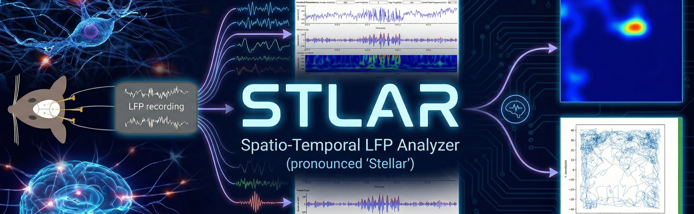

# STLAR: Spatio-Temporal LFP Analyzer



STLAR (or **Stellar**) combines temporal HFO detection, spatial spectral mapping, and optional deep learning workflows.

---

<a id="quickstart"></a>
## Quickstart

- Preferred Python: **3.12** (Conda recommended)

```bash
conda create -n stlar python=3.12
conda activate stlar
pip install -r requirements.txt
```

Run GUI:

```bash
python -m stlar gui
```

Run a simple CLI batch:

```bash
python -m stlar hilbert-batch -f path/to/data/
```

Windows reset tip (DLL / `_ctypes` issues after Python changes):

```bash
conda env remove -n stlar
conda create -n stlar python=3.12
conda activate stlar
pip install -r requirements.txt
```

---

## 📑 Table of Contents

### Getting Started
- [Quickstart](#quickstart)
- [Installation](#installation)
- [Features](#features)
- [Choose Your Workflow](#choose-your-workflow)

### Usage
- [GUI Workflow](#gui-workflow)
- [CLI Reference](#cli-reference)
  - [Detection Methods](#detection-methods)
- [HFO Metrics & Score Filtering](#hfo-metrics--score-filtering)
- [Spatial Mapping (batch-ssm)](#spatial-mapping-batch-ssm)
- [Complete Deep Learning Training Workflow](#complete-deep-learning-training-workflow)

### Advanced Docs
- [Advanced CLI Guide](docs/CLI_ADVANCED.md)
- [Advanced DL Training Guide](docs/DL_TRAINING_ADVANCED.md)
- [Consensus Detection](docs/CONSENSUS_DETECTION.md)
- [Detection Tuning](docs/DETECTION_TUNING.md)
- [Technical Reference](docs/TECHNICAL_REFERENCE.md)

### Support
- [Troubleshooting Installation](#troubleshooting-installation)
- [Getting Help](#getting-help)
- [Recent Changes](#recent-changes)

---

<a id="features"></a>
## Features

### Temporal Analysis
- HFO detection (Hilbert, STE, MNI, Consensus, Deep Learning)
- Scoring and event review workflow
- Time-frequency analysis (Stockwell transform)
- **Brain-region presets** — `--region LEC / Hippocampus / MEC` applies validated frequency bands, duration filters, and speed thresholds automatically

### Spatial Analysis
- Arena heatmaps and trajectory-aware mapping
- PSD across positions and chunks
- **Polar binning for circular arenas** — 2-ring × 8-sector occupancy-normalised maps
- **Chunk-size optimisation** — 30 s recommended for open-field; 1 s for near-continuous instantaneous frequency mapping
- Optional binned exports for downstream analysis

### Deep Learning
- Prepare training segments from EOIs
- Train and export custom models (5 architectures: Simple1DCNN, ResNet1D, InceptionTime, HFOTransformer, Spectrogram2DCNN)
- Use trained models in `dl-batch`
- **Export to TorchScript and ONNX** for deployment outside Python

### Input Formats
- **Axona EGF / EEG** (Tint format, auto gain calibration from `.set`)
- **Intan RHD2000** — converted automatically to Axona format via `Intan_to_Tint`

> **EEG vs EGF:** EEG files (250 Hz) support frequencies up to 125 Hz (theta, gamma). HFO detection (ripple 80–250 Hz, fast ripple 250–500 Hz) requires EGF files (4800 Hz). STLAR shows a clear warning when an EEG-only session is loaded.

---

<a id="installation"></a>
## Installation

### Requirements
- Python 3.10–3.13 supported (3.12 preferred)
- `pip`
- ~2-3 GB free disk

### Install

```bash
git clone https://github.com/HussainiLab/STLAR.git
cd STLAR

conda create -n stlar python=3.12
conda activate stlar
pip install -r requirements.txt
```

Optional editable install:

```bash
pip install -e .
```

#### Deep Learning optional dependencies

CPU:

```bash
pip install torch onnxruntime
```

GPU (CUDA 11.8):

```bash
pip install --index-url https://download.pytorch.org/whl/cu118 torch torchvision torchaudio
pip install onnxruntime-gpu
```

<a id="troubleshooting-installation"></a>
### Troubleshooting Installation

- `python` not found: try `python3`
- Conda not activating: run `conda init`, restart terminal
- Import errors: verify env active, rerun `pip install -r requirements.txt --upgrade`

---

## Choose Your Workflow

1. **GUI-first (recommended):** `python -m stlar gui`
2. **CLI batch processing:** `python -m stlar <command> ...`
3. **DL workflow:** `prepare-dl` → `train-dl` → `export-dl` → `dl-batch`

Recommended order for new users:
- Start with [GUI Workflow](#gui-workflow)
- Then use [CLI Reference](#cli-reference)
- Use advanced docs only when needed:
  - [Advanced CLI Guide](docs/CLI_ADVANCED.md)
  - [Advanced DL Training Guide](docs/DL_TRAINING_ADVANCED.md)

---

<a id="gui-workflow"></a>
## GUI Workflow

Launch:

```bash
python -m stlar gui
```

Basic flow:
1. Import `.set` / session folder — STLAR auto-loads the EEG or EGF source and speed trace
2. A status bar shows the active source type and its frequency limit
3. Open **Graph Settings** to add more sources or change filter settings
4. Open **HFO Detection** → **Automatic Detection** tab
5. Run detection (Hilbert / STE / MNI / Consensus / DL)
6. Move selected EOIs to **Score** tab
7. Label and save scores

> **EEG-only sessions** load cleanly with a theta-band default (4–12 Hz). To analyse HFOs, use an EGF file.

Spatial GUI:

```bash
python -m stlar spatial-gui
```

---

<a id="cli-reference"></a>
## CLI Reference

STLAR CLI format:

```bash
python -m stlar <command> [options]
```

Quick command groups:
- Detection: `hilbert-batch`, `ste-batch`, `mni-batch`, `consensus-batch`, `dl-batch`
- Analysis: `metrics-batch`, `filter-scores`, `batch-ssm`
- DL pipeline: `prepare-dl`, `train-dl`, `export-dl`

Basic examples:

```bash
python -m stlar hilbert-batch -f data/
python -m stlar consensus-batch -f data/ -v
python -m stlar dl-batch -f data/ --model-path models/hfo_detector.pt
```

### Detection Methods

- **Hilbert:** fast baseline detector for common ripple workflows
- **STE:** RMS-window energy detector
- **MNI:** percentile/baseline-driven detector
- **Consensus:** combines Hilbert + STE + MNI voting
- **DL:** model-based detection from exported `.pt` / `.onnx` (supports both 1D and CWT 2D models)

For full parameter tables and advanced recipes, see [Advanced CLI Guide](docs/CLI_ADVANCED.md).

---

## HFO Metrics & Score Filtering

Basic examples:

```bash
python -m stlar metrics-batch -f HFOScores/ -v
python -m stlar filter-scores -f HFOScores/session_HIL.txt --min-duration-ms 15 --max-duration-ms 120
```

Use this after detection to summarize event rates/durations and clean score files.

Advanced options (presets, behavior gating, custom speed thresholds):
- [Advanced CLI Guide](docs/CLI_ADVANCED.md#metrics-and-filtering)

---

## Spatial Mapping (batch-ssm)

Basic examples:

```bash
python -m stlar batch-ssm data/session.egf --ppm 595
python -m stlar batch-ssm data/ --ppm 595 --chunk-size 60
```

Optional exports:

```bash
python -m stlar batch-ssm data/ --ppm 595 --export-binned-csvs --plot-trajectory
```

Advanced spatial mapping usage and output details:
- [Advanced CLI Guide](docs/CLI_ADVANCED.md#spatial-mapping-batch-ssm)

---

## Complete Deep Learning Training Workflow

Minimal 4-step flow:

1. Prepare segments/manifests
2. Train model
3. Export model
4. Run `dl-batch` on new data

Basic commands:

```bash
python -m stlar prepare-dl --eoi-file detections.txt --egf-file recording.egf --output training_data --split-train-val
python -m stlar train-dl --train training_data/manifest_train.csv --val training_data/manifest_val.csv --epochs 15 --out-dir models
python -m stlar export-dl --ckpt models/best.pt --ts models/model.pt --onnx models/model.onnx
python -m stlar dl-batch -f new_recordings/ --model-path models/model.pt --threshold 0.5
```

**CWT models:** If you trained with `--use-cwt`, you must use `--use-cwt --fs <Hz>` during detection:

```bash
python -m stlar train-dl --train data/manifest_train.csv --val data/manifest_val.csv --use-cwt --fs 4800 --epochs 15 --out-dir models
python -m stlar export-dl --ckpt models/best.pt --ts models/cwt_model.pt
python -m stlar dl-batch -f new_recordings/ --model-path models/cwt_model.pt --use-cwt --fs 4800 --threshold 0.5
```

Advanced training topics (CWT, batch training, GUI monitoring, tuning, troubleshooting):
- [Advanced DL Training Guide](docs/DL_TRAINING_ADVANCED.md)

Cross-link: advanced guide points back to this quick workflow.

---

<a id="module-structure"></a>
## Module Structure

### Temporal Analysis (HFO Detection)
- Location: `hfoGUI/` and `stlar/`
- Entry: `python -m stlar`
- Docs: [Consensus Quickstart](docs/CONSENSUS_QUICKSTART.md), [Consensus Detection](docs/CONSENSUS_DETECTION.md)

### Spatial Analysis
- Location: `spatial_mapper/`
- Entry: `python -m stlar spatial-gui` or `python -m stlar batch-ssm`
- Docs: [Advanced CLI Guide (Spatial Mapping)](docs/CLI_ADVANCED.md#spatial-mapping-batch-ssm), [Technical Reference](docs/TECHNICAL_REFERENCE.md)

### Deep Learning
- Location: `hfoGUI/dl_training/`
- Entry: `prepare-dl`, `train-dl`, `export-dl`, `dl-batch`
- Docs: [Advanced DL Training Guide](docs/DL_TRAINING_ADVANCED.md), [Training Visualization](docs/TRAINING_VISUALIZATION.md)

## Original Tools

This project unifies:
- [hfoGUI](https://github.com/HussainiLab/hfoGUI)
- [Spatial_Spectral_Mapper](https://github.com/HussainiLab/Spatial_Spectral_Mapper)

## Documentation

### Core Guides
- [Advanced CLI Guide](docs/CLI_ADVANCED.md)
- [Advanced DL Training Guide](docs/DL_TRAINING_ADVANCED.md)
- [Technical Reference](docs/TECHNICAL_REFERENCE.md)
- [Consensus Detection](docs/CONSENSUS_DETECTION.md)
- [Consensus Quickstart](docs/CONSENSUS_QUICKSTART.md)
- [Detection Tuning](docs/DETECTION_TUNING.md)
- [Containerization Guide](docs/CONTAINERIZATION_GUIDE.md)

### GUI / DL / CWT
- [GUI Quickstart](docs/GUI_QUICKSTART.md)
- [Training Visualization](docs/TRAINING_VISUALIZATION.md)
- [CWT Debug Guide](docs/CWT_DEBUG_GUIDE.md)
- [Preset Gating Guide](docs/PRESET_GATING_GUIDE.md)

<a id="api-documentation"></a>
## API Documentation

For developer-oriented APIs and internals:
- [Technical Reference](docs/TECHNICAL_REFERENCE.md)
- `hfoGUI/core/`
- `hfoGUI/dl_training/`
- `spatial_mapper/src/`

<a id="getting-help"></a>
## Getting Help

- Check [Troubleshooting Installation](#troubleshooting-installation)
- Use [GUI Quickstart](docs/GUI_QUICKSTART.md) for first-run issues
- Use [Advanced CLI Guide](docs/CLI_ADVANCED.md) for command options
- Use [Advanced DL Training Guide](docs/DL_TRAINING_ADVANCED.md) for model pipeline issues

<a id="recent-changes"></a>
## Recent Changes

**GUI loading fixes**
- Fixed hang when importing a `.set` file (progress dialog deadlock)
- Fixed spurious "Invalid source filename" error on EEG-only sessions
- Status bar now shows whether an EEG or EGF file is loaded and the corresponding frequency limit
- EEG-only sessions load with safe theta-band defaults (4–12 Hz); a clear warning explains that HFO detection requires EGF

**New features**
- **Brain-region presets** — `--region LEC / Hippocampus / MEC` on `prepare-dl`, `metrics-batch`, and `filter-scores` applies validated parameters (frequency bands, duration filters, speed threshold) with one flag
- **Intan RHD2000 support** — `.rhd` files are converted automatically to Axona EGF/EEG format
- **ONNX and TorchScript export** — `export-dl` produces portable models for use outside Python
- **Polar spatial mapping** — circular arenas now use 2-ring × 8-sector equal-area polar binning; chunk-size of 30 s recommended for open-field
- **Model type 6 guard** — requesting `--model-type 6` on scipy ≥ 1.12 now raises a clear error with advice to use `--model-type 5` instead

**Bug fixes**
- `stlar` console script entry point now works after `pip install` (was broken by a missing alias)
- `dl-batch` supports CWT mode via `--use-cwt --fs <Hz>` flags (matches training pipeline)

---

GPL-3.0 License - see [LICENSE](LICENSE) for details.